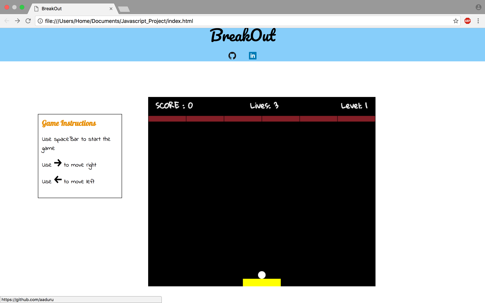

## BreakOut

### About the Game

In the game, a layer of bricks lines the top of the screen. A ball travels across the screen, bouncing off the top and side walls of the screen. When a brick is hit, the ball bounces away and the brick is destroyed. The player loses a turn when the ball touches the bottom of the screen. To prevent this from happening, the player has a movable paddle to bounce the ball upward, keeping it in play. I have 3 levels of increased difficulty.

[BreakOut][breakout]
[breakout]:https://aaduru.github.io/breakout/

### Game Design:

BreakOut was built in less than a week.

A [proposal][proposal] was drafted to help provide an implementation timeline during the development process.

[proposal]: ./images/README.md



### Architecture and Technologies

- The overall game logic and structure is built using Vanilla JavaScript
- for DOM manipulation and rendering utilized HTML5 Canvas
- implemented styling using CSS

The project has the following files.

`breakout.js`: Is the entry file of the game. It has event listeners to the canvas for keyboard moves(used to move the paddle) and spacebar(to start the game). The gameview's function start() gets triggered once the user presses spacebar.

`gameView.js`: This file binds the keys from the keymaster and passes them to the paddle, which helps in the movement of the paddle.It also has function start which is calls the the game's draw function in specific interval of time.

`game.js`: The main file which imports ball, paddle and brick files. The instances for above is created in the constructor and ball, paddle and bricks are displayed in the canvas. This file has the main brick ball collision logic.


collision logic for bottom side of brick

```js
if( ((this.brick.bricks[c][r].x - (this.radius/1.44)) <= this.ball.x) && (this.brick.bricks[c][r].x + this.brickWidth + (this.radius/1.44) >= this.ball.x)) {
  if((this.ball.y-this.radius) > (this.brick.bricks[c][r].y+this.brickHeight-Math.abs(this.ball.movey))){
    if((this.ball.y-this.radius) < (this.brick.bricks[c][r].y+this.brickHeight+Math.abs(this.ball.movey))){
      this.collision = true;
      this.ball.movey = - this.ball.movey;

    }
  }
}
```

logic :
if the ball's x position is between the bricks x position minus radius /√2 and bricks x position summed with bricks width and radius / √2 is true then we check for the y value. if the ball's y position  is between bricks y position summed with height and ball's y update value and bricks y position plus bricks  height minus ball's update value is true then we set the new ball's update value.

I calculated the ball's left, right and bottom in the similar way.


The game has three levels. A user can go to the next level only if the all the bricks in the current level are hit.


`ball.js`: This class has 2 functions, one to display the ball and one function to move the ball around the canvas.

`bricks.js`: This class has 2 functions, one to create the array of brick objects. The other function displays the brick objects that are not hit.

`paddle.js`: this class has 2 functions, one to display the paddle. The other function moves the paddle when the user presses key.

```js

Object.keys(GameView.MOVES).forEach((k) => {
  let move = GameView.MOVES[k];

  key(k, () => {
  this.game.paddle.updatePaddle(move); });

});
}
```

When the user presses an arrow the move value gets passed to the the updatePaddle function.

```js

    if (move === -10 ){
      if (this.x > 10){
          this.x += (-10);
      }
      else {
        this.x = 0;
      }
    }
```
if left arrow is pressed then the paddle's x position is summed with the move value and the paddle moves left.


### Bonus features

 Some anticipated updates are:

- [ ] In the increased difficulty level add bricks which have to be hit multiple times to be broken
- [ ] In the last level add 2 balls which the user has to control simultaneously.
